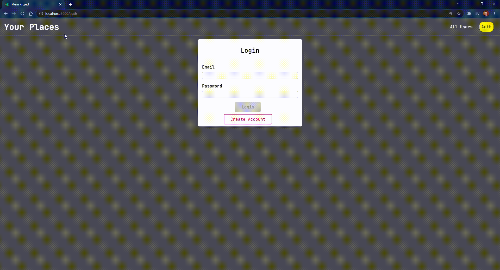

<h1 align="center">
   Introdução ao FullStack com MERN
</h1>

<br>

## 💻 Projeto

Este projeto tem como objetivo entender as bases de um projeto fullstack com MERN (MongoDB, Express, React e NodeJS)

- [x] MongoDB
- [x] Express
- [x] React
- [x] NodeJS

## ✨ Tecnologias

Esse projeto foi desenvolvido com as seguintes tecnologias/bibliotecas:

- [MongoDB](https://www.mongodb.com/)
- [Express](https://expressjs.com/)
- [React](https://reactjs.org/)
- [NodeJS](https://nodejs.org/en/)

## 🔖 Layout



## 🚀 Instalação Frontend

```bash
# Clone o repositório e entre na pasta do projeto
$ git clone https://github.com/lucasspeixoto/mern_course && cd mern_course/frontend

# Instale as dependências
$ npm install
# ou
$ yarn install

# Execute a aplicação
$ npm start
# ou
$ yarn start

# Abra http://localhost:3000 no seu navegador para ver a aplicação rodando!

```

## 🚀 Instalação Backend

```bash
# Clone o repositório e entre na pasta do projeto
$ git clone https://github.com/lucasspeixoto/mern_course && cd mern_course/backend

# Instale as dependências
$ npm install
# ou
$ yarn install

# Execute a aplicação
$ npm start
# ou
$ yarn start

```

## 📝 Licença

Este projeto está licenciado sob a Licença MIT. Veja o arquivo [LICENSE](LICENSE) para obter mais detalhes.

---
